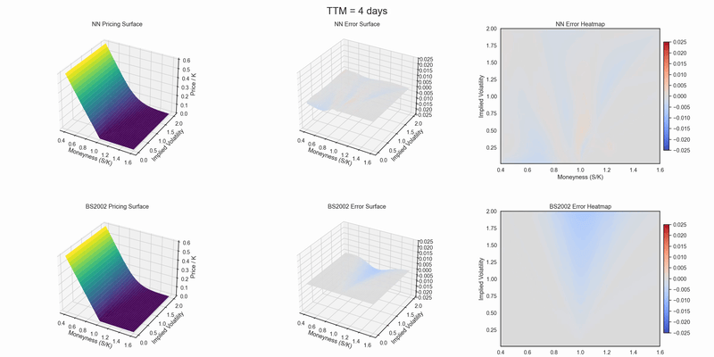

# Option Pricing via Neural Surrogates

Fastvol includes preliminary neural network surrogates for American vanilla option pricing and implied volatility inversion.  

The idea is straightforward: train small, well-optimized networks that can replace expensive iterative or simulation-based methods in scenarios where *speed* matters more than exact reproducibility. In practice, compiled neural surrogates can price hundreds of millions of options per second on modern GPUs, making them well-suited for large-scale analytics, pre-trade scanning, or research workloads.

In recent years, the financial industry has actively explored neural networks as surrogates for option pricing, especially for exotic derivatives and for estimating Greeks — where finite-difference methods are noisy and require many repeated valuations. In principle, once a network has learned the structure of the pricing function, the forward pass is just a handful of matrix multiplications, which hardware like NVIDIA GPUs can execute extremely efficiently.

Academia has published a handful of MLP-based approaches, but as far as we know there are no open-weight, reproducible models with comprehensive evaluation across realistic parameter ranges. Fastvol aims to fill that gap.

  
  
<em>Figure: Pricing accuracy comparison on American Puts: Neural Surrogate vs Bjerksund-Stensland 2002 </em>

## Design

Both the value networks (`_VNet`) and implied volatility networks (`_IVNet`) share the same architectural philosophy:

- Shared stem: learns general “market structure” features from normalized and transformed inputs (e.g. spot/strike ratio, log-moneyness, scaled rates/dividends).
- Branching heads for calls and puts: handles the fact that moneyness has an inverse and non-linear relationship between calls and puts.
- Light preprocessing in-model:  
  - Value net standardizes inputs and outputs by strike, so predictions are stable across different price scales.  
  - IV net normalizes price by strike and masks options with zero time value.  
- Activation choices:  
  - SiLU in hidden layers — smoother than ReLU and more stable for autograd when computing Greeks.  
  - ReLU at the output — enforces non-negative prices/IV without extra post-processing.

## Training

These preliminary networks were trained on roughly *1 billion* synthetic options priced with BOPM at 2048 steps on fp64 precision, sampled over wide parameter ranges:

- Moneyness: 0.3 – 2.0  
- Implied vol: 0.01 – 2.0  
- Time to maturity: 0.001 – 2.0 years  
- Rates/dividends: broad uniform ranges

This produces models that generalize across diverse market conditions — including unusual strikes, extreme vols, and short-dated contracts.

## Performance and caveats

- Speed: Orders of magnitude faster than iterative methods; ideal for batched pricing or IV inversion on GPUs.
- Accuracy: Generally high, but error patterns differ from closed-form approximations.  
  - For very short maturities and low vols, the predicted price surface can be uneven — sometimes over- or under-pricing locally — whereas approximations like Bjerksund–Stensland tend to have a consistent and predictable bias. This opens the door to ensemble models between traditional approximations and neural surrogates, which we aim to explore in the future.
- Greeks: Because the networks are differentiable, Greeks can be obtained via autograd with minimal extra cost.

These models are still evolving — future work will focus on reducing local surface noise, adding stochastic/exotic payoffs, and publishing detailed benchmark tables.

## Sample Results

Below are representative samples from the trained pricing and implied volatility inversion networks.

Pricing tends to be highly accurate across a wide range of market conditions.  
IV inversion is more challenging in edge cases — particularly when time value is very low and Vega near-zero, where very different implied vols can yield nearly identical prices.  
In these regimes, even tiny price perturbations lead to large relative IV errors, which is a fundamental inversion problem rather than a network deficiency.

---

### American Pricing Network (`_VNet`)
MSE Loss : `0.000551`  
MSE Scale: options with strike 100.0

| spot   | strike | c/p | ttm  | iv   | pred  | true  | abs err |
|--------|--------|-----|------|------|-------|-------|---------|
|  89.21 | 100.0  |  c  | 1.91 | 1.66 | 65.84 | 65.82 | 0.02 |
| 118.42 | 100.0  |  c  | 0.51 | 1.07 | 43.22 | 43.22 | 0.00 |
| 103.33 | 100.0  |  p  | 1.31 | 0.45 | 16.26 | 16.25 | 0.01 |
| 168.79 | 100.0  |  p  | 0.51 | 0.47 |  0.90 |  0.90 | 0.01 |
|  99.16 | 100.0  |  c  | 0.59 | 1.75 | 49.28 | 49.28 | 0.00 |
|  96.88 | 100.0  |  c  | 1.67 | 0.34 | 13.47 | 13.51 | 0.04 |
| 165.43 | 100.0  |  p  | 0.77 | 1.63 | 36.55 | 36.55 | 0.01 |
| 141.33 | 100.0  |  p  | 1.54 | 0.14 |  0.00 |  0.04 | 0.04 |
| 128.77 | 100.0  |  p  | 0.49 | 1.94 | 43.55 | 43.57 | 0.01 |
|  84.07 | 100.0  |  p  | 1.39 | 1.88 | 73.31 | 73.31 | 0.00 |
| 170.34 | 100.0  |  p  | 1.50 | 1.04 | 27.09 | 27.10 | 0.01 |
| 100.29 | 100.0  |  c  | 1.12 | 1.79 | 65.06 | 65.04 | 0.02 |
|  93.21 | 100.0  |  c  | 0.58 | 0.35 |  7.23 |  7.21 | 0.02 |
| 167.62 | 100.0  |  c  | 0.51 | 0.25 | 70.24 | 70.24 | 0.00 |
| 117.91 | 100.0  |  c  | 1.81 | 1.05 | 66.53 | 66.53 | 0.00 |
|  56.86 | 100.0  |  p  | 0.65 | 0.27 | 43.16 | 43.14 | 0.01 |
| 179.25 | 100.0  |  c  | 0.96 | 0.96 | 98.75 | 98.74 | 0.01 |
|  45.79 | 100.0  |  c  | 0.23 | 1.75 |  5.37 |  5.37 | 0.01 |
| 142.48 | 100.0  |  c  | 1.70 | 0.15 | 54.10 | 54.13 | 0.03 |
| 132.37 | 100.0  |  c  | 0.60 | 0.70 | 46.12 | 46.13 | 0.01 |
|  88.71 | 100.0  |  p  | 1.17 | 0.17 | 11.25 | 11.29 | 0.04 |
| 167.09 | 100.0  |  p  | 1.06 | 1.17 | 27.37 | 27.36 | 0.00 |
|  65.23 | 100.0  |  c  | 2.00 | 1.57 | 42.79 | 42.78 | 0.01 |
|  64.83 | 100.0  |  c  | 0.54 | 1.18 | 13.05 | 13.05 | 0.00 |
|  76.53 | 100.0  |  c  | 0.52 | 1.85 | 32.92 | 32.93 | 0.01 |

---

### American IV Inversion Network (`_IVNet`)
MSE Loss: `0.002538`  
MSE Scale: IV as a decimal

| price  | spot   | strike | c/p | ttm  | pred IV | true IV | abs err |
|--------|--------|--------|-----|------|---------|---------|---------|
|  25.45 | 185.77 | 100.0  |  p  | 0.68 | 138.54% | 138.67% |  0.13 |
|  55.60 | 140.39 | 100.0  |  c  | 1.38 |  31.82% |  34.40% |  2.58 |
| 130.08 | 184.19 | 100.0  |  c  | 0.87 | 170.92% | 171.66% |  0.74 |
|  24.71 |  87.98 | 100.0  |  p  | 0.69 |  70.10% |  68.94% |  1.16 |
|  14.80 |  65.36 | 100.0  |  c  | 1.22 |  86.89% |  87.12% |  0.23 |
|  41.73 | 128.17 | 100.0  |  c  | 1.76 |  32.95% |  32.94% |  0.01 |
|  22.91 |  97.13 | 100.0  |  c  | 0.20 | 142.68% | 143.93% |  1.25 |
|  38.92 |  61.37 | 100.0  |  p  | 0.88 |  55.91% |  53.53% |  2.38 |
|  12.60 |  48.21 | 100.0  |  c  | 1.67 |  96.61% |  96.90% |  0.28 |
|  10.32 |  93.03 | 100.0  |  p  | 1.04 |  18.61% |  19.22% |  0.60 |
|  63.49 |  56.34 | 100.0  |  p  | 1.72 | 101.21% | 100.98% |  0.23 |
|  45.67 |  95.14 | 100.0  |  c  | 1.45 | 115.19% | 115.61% |  0.42 |
|  18.02 | 105.70 | 100.0  |  p  | 0.09 | 178.25% | 177.01% |  1.25 |
|  61.71 |  38.69 | 100.0  |  p  | 1.59 |  78.61% |  76.77% |  1.84 |
|   5.96 |  33.04 | 100.0  |  c  | 0.61 | 154.58% | 155.28% |  0.70 |
|  25.68 | 109.92 | 100.0  |  p  | 1.10 |  70.32% |  70.55% |  0.23 |
|   0.00 |  70.16 | 100.0  |  c  | 1.12 |   7.13% |   7.33% |  0.20 |
| 104.80 | 199.60 | 100.0  |  c  | 1.61 |  22.08% |  32.78% | 10.70 |
|  59.90 | 192.54 | 100.0  |  p  | 1.27 | 187.79% | 188.74% |  0.96 |
|  95.28 | 178.90 | 100.0  |  c  | 1.15 |  77.47% |  78.07% |  0.60 |
|  13.57 | 140.14 | 100.0  |  p  | 1.66 |  50.98% |  50.93% |  0.05 |
|  80.22 |  33.89 | 100.0  |  p  | 0.99 | 178.62% | 177.94% |  0.68 |
|  48.37 | 148.22 | 100.0  |  c  | 0.02 |  68.07% | 128.40% | 60.32 |
|  39.17 |  85.34 | 100.0  |  c  | 1.87 | 106.56% | 108.16% |  1.60 |
|   0.01 | 159.11 | 100.0  |  p  | 0.95 |  19.02% |  18.92% |  0.10 |

> **Note:** The two largest errors (`10.70%` and `60.32%`) occur where time value is extremely small. In these cases, option Vega is near zero, meaning a wide range of implied volatilities will produce almost identical prices, making the inversion problem ill-conditioned.

