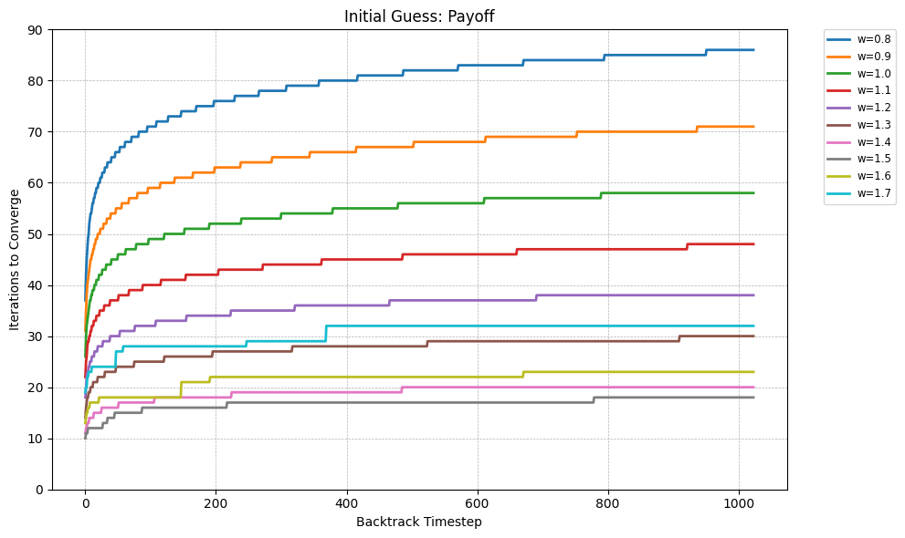
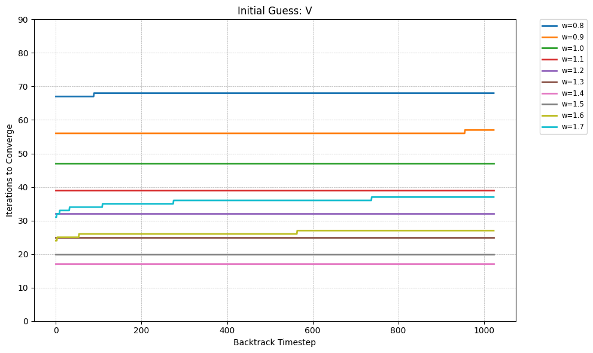
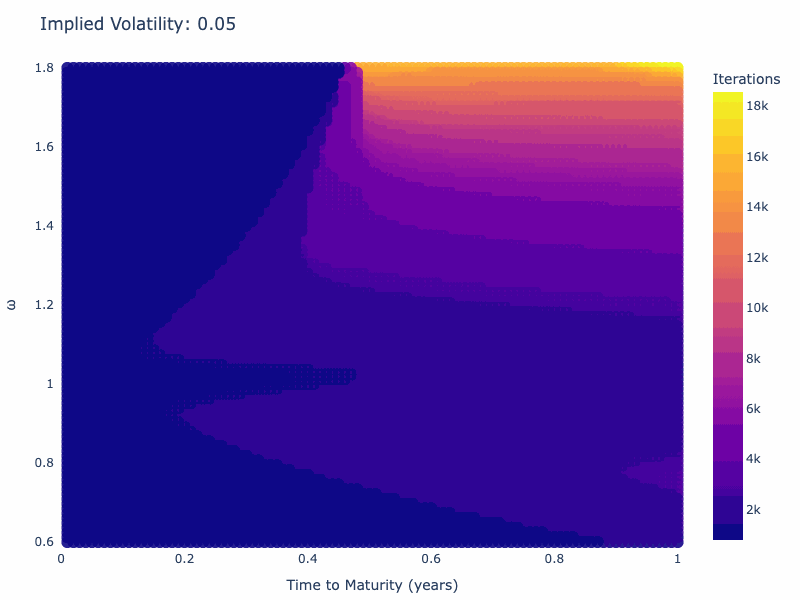
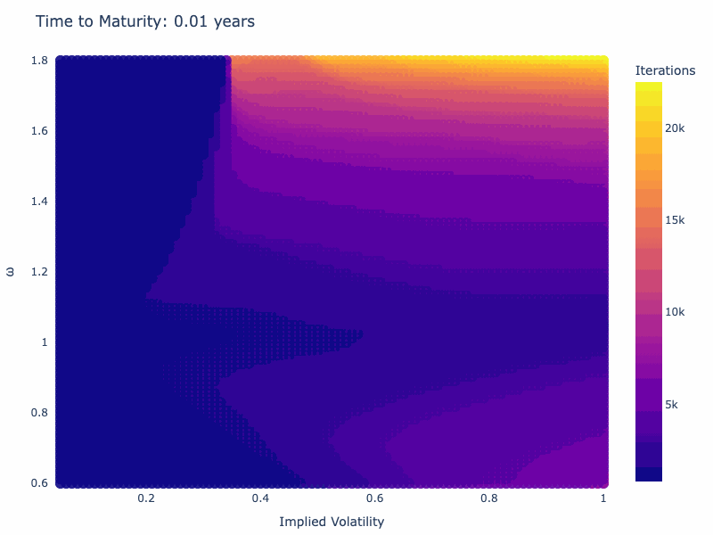
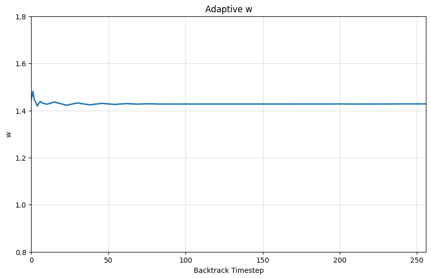

# American Options via PDEs

## The Black-Scholes PDE

We begin with the standard Black-Scholes PDE, which describes the value $V(S, t)$ of a derivative under the risk-neutral measure:

```math
\frac{\partial V}{\partial t} + \frac{1}{2} \sigma^2 S^2 \frac{\partial^2 V}{\partial S^2}
+ (r - q) S \frac{\partial V}{\partial S} - r V = 0
```

Where:
- $S$ is the spot price of the asset,
- $t$ is time to maturity,
- $\sigma$ is volatility,
- $r$ is the risk-free rate,
- $q$ is the dividend yield.

Compactly, this can be written as:

```math
\frac{\partial V}{\partial t} + \mathcal{L}(V) = 0
```

where $\mathcal{L}$ is the Black-Scholes differential operator:

```math
\mathcal{L}(V) = \frac{1}{2} \sigma^2 S^2 \frac{\partial^2 V}{\partial S^2}
+ (r - q) S \frac{\partial V}{\partial S} - r V
```

---

## American Options and the Variational Inequality

Unlike European options, which can only be exercised at maturity, American options allow for early exercise at any time prior to expiration. This introduces a free-boundary problem, where the solution must simultaneously satisfy the PDE and the possibility of early exercise.

This condition is expressed as a variational inequality

```math
\min\left( -\frac{\partial V}{\partial t} - \mathcal{L}(V),\; V - \text{payoff} \right) = 0
```

In other words:
- If it's optimal to hold the option, then the Black-Scholes PDE must be satisfied.
- If it's optimal to exercise, then $V = \text{payoff}$ must hold.

This yields the complementarity conditions

```math
-\frac{\partial V}{\partial t} - \mathcal{L}(V) \geq 0, \quad
V \geq \text{payoff}, \quad
\left( -\frac{\partial V}{\partial t} - \mathcal{L}(V) \right)(V - \text{payoff}) = 0
```

This ensures that at each point in space and time, either the PDE holds and the option is held, or the value equals the immediate exercise value — but not both.

---

## Time Discretization

To numerically solve this problem, we discretize time using the backward Euler method with step size $\Delta t$. This yields:

```math
\frac{V^n - V^{n+1}}{\Delta t} + \mathcal{L}(V^n) = 0
```

Rewriting:

```math
\left(I + \Delta t \cdot \mathcal{L} \right)V^n = V^{n+1}
```

We can then define the matrix:

```math
A := I + \Delta t \cdot \mathcal{L}
```

which leads to the linear system:

```math
A V^n = V^{n+1}
```

In the case of American options, this becomes a Linear Complementarity Problem (LCP) at each timestep:

```math
A V^n \geq V^{n+1}, \quad
V^n \geq \text{payoff}, \quad
(A V^n - V^{n+1})^\top (V^n - \text{payoff}) = 0
```

The goal is to find a vector $V^n$ that satisfies the PDE where holding is optimal, and matches the payoff where exercise is optimal.

---

## Spatial Discretization

Similarly, we proceed to discretizing the spatial domain $S \in [S_{\min}, S_{\max}]$ using a uniform grid:

```math
S_i = S_{\min} + i h, \quad h = \text{grid spacing}, \quad i = 0, \dots, N-1
```

The spatial derivatives can be approximated using central differences:

- First derivative:
  ```math
  \frac{\partial V}{\partial S} \approx \frac{V_{i+1} - V_{i-1}}{2h}
  ```

- Second derivative:

  ```math
  \frac{\partial^2 V}{\partial S^2} \approx \frac{V_{i+1} - 2V_i + V_{i-1}}{h^2}
  ```

Plugging into $\mathcal{L}(V)$ gives a tridiagonal matrix $A$ whose entries vary at every point due to the presence of $S_i$ in the coefficients:

- Lower diagonal (i.e., $A_{i,i-1}$):

```math
\alpha_i = \frac{\Delta t}{2} \left( \sigma^2 S_i^2 \cdot \frac{1}{h^2} - (r - q) S_i \cdot \frac{1}{h} \right)
```

- Main diagonal:

```math
\beta_i = 1 + \Delta t \left( \sigma^2 S_i^2 \cdot \frac{1}{h^2} + r \right)
```

- Upper diagonal:

```math
\gamma_i = \frac{\Delta t}{2} \left( \sigma^2 S_i^2 \cdot \frac{1}{h^2} + (r - q) S_i \cdot \frac{1}{h} \right)
```

The dependence of $A$ on $S_i$ is a significant drawback. Every option leads to a different matrix, and this complicates vectorization, memory locality, and parallelization. This non-uniformity makes the matrix harder to optimize and reuse across contracts, which leads to the adoption of log-space computation. 

To fix this, we apply a change of variables:

```math
x = \log S
```

Let $\tilde{V}(x, t) := V(e^x, t)$. Applying the chain rule, the Black-Scholes PDE becomes:

```math
\frac{\partial \tilde{V}}{\partial t}
+ \left( r - q - \frac{1}{2} \sigma^2 \right) \frac{\partial \tilde{V}}{\partial x}
+ \frac{1}{2} \sigma^2 \frac{\partial^2 \tilde{V}}{\partial x^2}
- r \tilde{V} = 0
```

This PDE now has constant coefficients, independent of $x$.


We now place a uniform grid on $x$:

```math
x_i = x_{\min} + i \cdot \Delta x, \quad i = 0, 1, \dots, N-1
```

Using central differences:

- First derivative:

  ```math
  \frac{\partial \tilde{V}}{\partial x} \approx \frac{\tilde{V}_{i+1} - \tilde{V}_{i-1}}{2\Delta x}
  ```

- Second derivative:

  ```math
  \frac{\partial^2 \tilde{V}}{\partial x^2} \approx \frac{\tilde{V}_{i+1} - 2\tilde{V}_i + \tilde{V}_{i-1}}{\Delta x^2}
  ```

Plugging into the transformed PDE gives a tridiagonal matrix $A$ with constant entries:

- Lower diagonal:

  ```math
  \alpha = \frac{\Delta t}{2} \left( \frac{\sigma^2}{\Delta x^2} - \frac{r - q - \frac{1}{2} \sigma^2}{\Delta x} \right)
  ```

- Main diagonal:

  ```math
  \beta = 1 + \Delta t \left( \frac{\sigma^2}{\Delta x^2} + r \right)
  ```

- Upper diagonal:

  ```math
  \gamma = \frac{\Delta t}{2} \left( \frac{\sigma^2}{\Delta x^2} + \frac{r - q - \frac{1}{2} \sigma^2}{\Delta x} \right)
  ```

This uniform structure simplifies numerical implementation and enables efficient memory access and SIMD/GPU acceleration.

---

## Solving the LCP

At each timestep, we solve the LCP:

```math
A V^n \geq V^{n+1}, \quad V^n \geq \text{payoff}, \quad (A V^n - V^{n+1})^\top (V^n - \text{payoff}) = 0
```

This problem arises from the early exercise feature of American options, and must be solved iteratively. Concretely, this means that for each of the `n_t` timesteps we backtrack from expiration, we are required to solve another iterative task over the `n_s` spatial grid points. This leads to a nested for loop with runtime $`\mathcal{O}(`$ `n_t` $`\cdot`$ `n_it` $`\cdot`$ `n_s` $`)`$, where `n_it` is our estimated number of iterations over the spatial points `n_s` until the solver converges to the correct $V^n$. As such, it is imperative to (a) minimize our number of iterations until convergence `n_it` and (b) minimize the amount of time it takes to complete each iteration over all `n_s` grid points. We will see that the Jacobi method is able to achieve (b), while PSOR achieves (a), and how we can combine the best of both into a Red-Black PSOR scheme.

### Jacobi Method

The Jacobi method updates each component independently, using values from the previous iteration:

```math
V_i^{(k+1)} = \max\left( \text{payoff}_i, (1-\omega)V_i^{(k)} + \frac{\omega}{A_{ii}} \left( V_i^{n+1} - \sum_{j \ne i} A_{ij} V_j^{(k)} \right) \right)
```

Where relaxation parameter $\omega \in (0, 2)$ controls the update aggressiveness, and $k$ is the iteration within the solving loop. Because this only utilizes values from previous iterations, this means that each of the `n_it` iterations are simple to vectorize and interleave, since there are no loop-carried dependencies and register pressure can remain low (i.e. there are not many variables for our cpu to hold). Conversely, because it uses "old" values, convergence requires more iterations.

### Projected Successive Over-Relaxation (PSOR)

The PSOR method improves on Jacobi by incorporating updates as soon as they are computed:

```math
\hat{V}_i^{(k+1)} = \frac{1}{A_{ii}} \left( V_i^{n+1} - \sum_{j < i} A_{ij} V_j^{(k+1)} - \sum_{j > i} A_{ij} V_j^{(k)} \right)
```

```math
V_i^{(k+1)} = \max\left( \text{payoff}_i,\; (1 - \omega) V_i^{(k)} + \omega \hat{V}_i^{(k+1)} \right)
```
PSOR often converges in significantly fewer iterations than Jacobi, especially for tridiagonal systems. However, due to the dependence on freshly updated values, this impedes vectorization, and our speed per iteration is significantly slower.

### Red-Black Projected SOR (RB-PSOR)

In order to lower the number of iterations until convergence, and maximize the speed per iteration, we can adopt a Red-Black PSOR scheme. The core idea is to split the grid points into two interleaved subsets:

- Red points: all even indices
- Black points: all odd indices

These subsets are mutually non-adjacent in a tridiagonal system, meaning all red nodes can be updated simultaneously, then all black nodes. In each iteration, this allows us to:

1. Update all red points using the latest black values
2. Update all black points using the new red values

This structure provides a compromise between:

- Jacobi: where each iteration is fast, but more are required
- PSOR: where each iteration is slow, but fewer are required

RB-PSOR offers the best of both worlds in theory (and practice), by minimizing the number of iterations due to its PSOR-like nature, and minimizing the time per iteration due to its Jacobi-like parallel updates that are highly amenable to SIMD vectorization and parallel processing on GPU thread-groups. 


---

## Applying These Methods in Practice
Let’s now turn to implementation. Below, we sketch pseudocode and simplified C-style loops to clarify the mechanics and vectorization potential of each method, with $a=\alpha$, $b=\beta$, and $c=\gamma$. It's important to note that during the iterations we only update inner points, so `N=N_S-2`.

Because the implementations are written in C, we avoid expensive memory copies by using 
double-buffering and pointer swaps. At each timestep, we keep the main option values in 
an array `v`, and use `x` and `x_old` as working buffers to compute the solution to the next linear system. Conceptually, at any point in the iterative backward stepping process, we are solving a system of the form: `A x = v`, and then swapping `x` and `v` before moving to the next time step.

```c
double v[N];     // value buffer
double x[N];     // iteration buffer
double x_old[N]; // previous iteration buffer
```

At the start of each iterative solve for `x`, we initialize it with a guess — stored in `x_old` (or directly in `x` if only one buffer is needed). The initial guess is typically set to either the payoff at that node, or to the next timestep's values (i.e. the contents of `v` in the system $Ax = v$). The choice of initialization affects convergence and will be discussed in detail later. 

### Jacobi

Fully parallel update using old values and a relaxation factor `omega`:
```c
for (int i = 1; i < N - 1; i++) {
    double sum = a * x_old[i - 1] + b * x_old[i] + c * x_old[i + 1];
    double relaxed = (1 - omega) * x_old[i] + omega * (v[i] - sum) / b;
    x[i] = max(payoff[i], relaxed);
}
```
For `i=0` and `i=N-1`, we apply the same procedure but omit the term from the `x_old` point that would be out-of-bounds and apply boundary corrections. As we can see, values are only read from `x_old`, and only written to `x`. This means there are no loop-carried dependencies, and register pressure is fairly low once we pull out loop-independent terms such as `1-omega` and `omega/b`. These factors contribute to an inner loop that can take full advantage of hardware accelerations through SIMD, and parallel threads on GPUs. With vectorization enabled, register pressure rises and compilers often prefer wide vectors over ILP/interleaving: we read from multiple arrays (`x_old`, `v`, `payoff`) and write to `x`. The upside is that residual checks (e.g., accumulating the L2 norm of $x^{k+1} - x^{k}$) can be fused into the update loop essentially for free: the loads/FMA are already there, and one–two extra FMAs for the reduction slot neatly between memory ops, so the compiler overlaps them with the main updates. This will hold for our RB-PSOR implementation later as well.

### PSOR 

PSOR, on the other hand:

```c
for (int i = 1; i < N - 1; i++) {
    double sum = a * x[i - 1] + c * x[i + 1];
    double relaxed = (1 - omega) * x[i] + omega * (v[i] - sum) / b;
    x[i] = max(payoff[i], relaxed);
}
```
This looks almost identical like the Jacobi loop, except that on iteration `i`, updating `x[i]` now requires reading `x[i-1]` which contains a freshly updated value. This is both why it takes fewer loops to converge, but also why the loops can't vectorize well -- loop-carried dependencies are a nightmare for compiler optimizations. On GPU, this also does not bode well for parallel execution across threads, as these would now need to wait on each other.


### RB-PSOR 

Black pass: update odd indices

```c
for (int i = 1; i < N - 1; i += 2) {
    double sum = a * x[i - 1] + c * x[i + 1];
    double relaxed = (1 - omega) * x[i] + omega * (v[i] - sum) / b;
    x[i] = max(payoff[i], relaxed);
}
```

Red pass: update even indices

```c
for (int i = 2; i < N - 1; i += 2) {
    double sum = a * x[i - 1] + c * x[i + 1];
    double relaxed = (1 - omega) * x[i] + omega * (v[i] - sum) / b;
    x[i] = max(payoff[i], relaxed);
}
```

While in this implementation, we now do not require an `x_old` buffer, each `x[i]` update depends on `x[i-1]` and `x[i+1]` values that stem from different red/black layers. These are freshly updated, like in PSOR, but remove loop-carried dependencies, restoring the vectorization and interleaving benefits from the Jacobi method. In practice, RB-PSOR converges in as few iterations as PSOR and individual iterations are as fast as in Jacobi: truly the best of both.

If you look at the final implementation in [psor.hpp](../core/include/fastvol/american/psor.hpp) you will see that it looks quite a bit different from this. The added complexity is partly due to manual unrolling of the first iteration to avoid copying the payoff values into `x` for the first red pass, but mainly to the split-buffered approach to separate red and black buffers. While this is painstaking and leads to many off-by-one errors in development, it significantly improves cache locality by removing strided reads/writes (the `i+=2` increments) and leads to a full 2x speedup compared to the pseudocode above.

The CUDA implementations follows a similar pattern as for the tree methods: due to the significant memory requirements of PSOR, buffers are stored in shared memory between cooperative groups tiling the red/black updates across a pool of threads. The only difference with the CPU version is that manual peeling of `i=0` and `i=N-1` is replaced with simple in-loop conditional masking to minimize the number of block syncs -- masking is cheap on CUDA where threads operate in lockstep compared to the cost of doubling block syncs per iteration.


### Initial Guess: Payoff vs $V^{n+1}$

Before discussing choice of the $\omega$ parameter, I find the choice of initial guess for `x` in the PSOR iterations very interesting. There are two trains of thoughts guiding the choice, both of which have merit:
- $V^{n+1}$ should be close to $V^{n}$, so relatively few update iterations should get us from one to the other.
- Starting from the boundary might mitigate the effects of the payoff boundary constraint in PSOR (over regular SOR) and facilitate updating `x` more smoothly towards the correct `v` value.

The following are some examples over different values of $\omega$ showing the change in number of iterations until convergence (inner loops over `n_s`) for all `n_t` timesteps backwards from expiration, i.e. iteration 0 is the first step back from expiration.

<table>
  <tr>
    <td></td>
    <td></td>
  </tr>
  <tr>
    <td align="center"><em>Initial Guess: Payoff</em></td>
    <td align="center"><em>Initial Guess: Last V</em></td>
  </tr>
</table>

It's fascinating to see that starting with $V^{n+1}$ matches our intuition in that it takes the same number of iterations to converge at each step, i.e. "each step is equally as far from the next". Similarly, the payoff guesses are much sharper at first, closer to expiration, and degrade over time. 

Using $V^{n+1}$ is compelling due to the fact that the iteration count remains equal over the  `n_t` outer loops, leading to more predictable runtimes (after the first few iterations) and an easier heuristic to adaptively pick $\omega$ (see next section). However, with the optimal $\omega$ parameter, the total iteration count is often 20% or so lower when using payoff as initial guess versus using $V^{n+1}$. This leads to ideas of hybrid approaches: start with payoff as initialization, then switch to $V^{n+1}$. Above all, though, these graphs show the importance of choosing the right $\omega$ parameter: while the above depict an optimal parameter between 1.4 and 1.5, this depends entirely on the parameters of the option being priced, and in practice this parameter can vary anywhere between 0.7 and 1.8. Choosing a parameter slightly too low or too high, and the runtime can balloon by factors of 10.

### Search for optimal omega

The below animations display the total number of iterations depending on $omega$ and certain combinations of implied volatility and time to maturity.

<table>
  <tr>
    <td></td>
    <td></td>
  </tr>
  <tr>
    <td align="center"><em>Animated over iv</em></td>
    <td align="center"><em>Animated over ttm</em></td>
  </tr>
</table>

For regular SOR, there exists a formula for the optimal $\omega$:

```math
\omega_{opt} = \frac{2}{1 + \sqrt{1-\rho(B)^2}}
```
where $\rho(B)$ is the spectral radius of the Jacobi iteration matrix $B$. In our case, with our tridiagonal matrix $A$ with fixed diagonal coefficients $a,b,c$ this simplifies to:

```math
\rho(B) = \frac{|a+c| \cos(\pi / (n+1))}{b}
```

However, this formula assumes Dirichlet boundary conditions and the classical SOR convergence theory. Due to the projection from the payoff boundary, this $\omega$ is not necessarily optimal, and sometimes differs quite significantly from the true optimal. However, it is a good first estimate, that we can adjust between timesteps.

Here are some simple empirical observations we can make when looking at the iteration counts over timestep that hold for both payoff and $V^{n+1}$ initializations.

- for any $\omega$, the number of iterations is non-decreasing 
- at any timestep, optimal $\omega$ vs iterations is convex

As such, we can formulate a simple gradient-descent-like strategy to adaptively update $\omega$ with effectively no overhead, but significant time-saving upsides:

- set a direction `w_delta` to increase `w` by between timesteps
- if our iteration count increases, revert direction: `w_delta = -w_delta`
- if our iteration count decreases, set our previous timestep as our `w_lo` or `w_hi` boundary, and decrease `w_delta` magnitude to a factor of the new `w_hi - w_lo` range.

This yields a rapid convergence towards the optimal $\omega$ within the 30 or so first timesteps, after which the update logic can be disabled. 

<table>
  <tr>
    <td></td>
    <td></td>
  </tr>
  <tr>
    <td align="center"><em>Adaptive w with random init</em></td>
    <td align="center"><em>Adaptive w with SOR-optimal init</em></td>
  </tr>
</table>