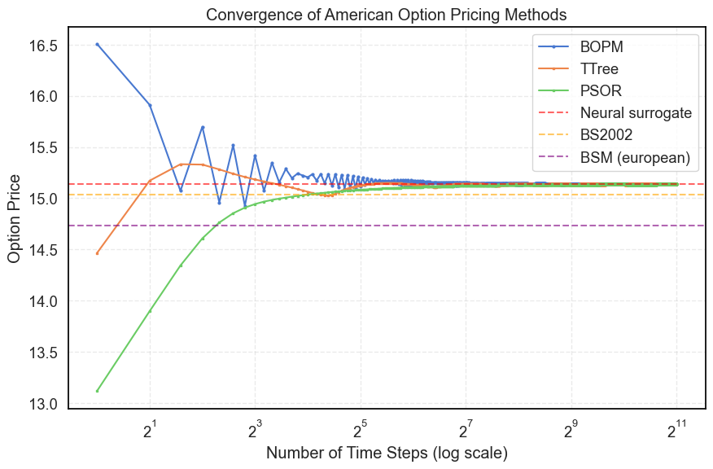

# American Options via Tree Methods

## The Binomial Option Pricing Model (BOPM)

The binomial tree method models the evolution of the underlying asset price $S$ over discrete timesteps $\Delta t = T / N$ until expiration, where $T$ is the time to maturity and $N$ is the number of steps. 
At each step, the asset can move:

- Up by a factor $u$
- Down by a factor $d = 1/u$

Under the risk-neutral measure, the probability of an up-move is:

```math
p = \frac{e^{(r - q) \Delta t} - d}{u - d}
```

where:
- $r$ = risk-free rate  
- $q$ = dividend yield

Because we know what the value at expiration will be for a wide range of spot prices, we can step back in time $\Delta t$ units at a time and determine the fair value of the option at that point by computing the expected value of the option if held onto the next timestep (where it becomes an expectation over an up or a down move) and comparing it with the value if the option were exercised instead.

In the most common implementation of the BOPM method, the $u$/$d$ multipliers follow the Cox-Ross-Rubinstein (CRR) implementation:  
  $$u = e^{\sigma \sqrt{\Delta t}}, \quad d = \frac{1}{u}$$

It is important to note that this leads to a recombining tree: $u\cdot d = 1$. This property ensures that an up-move followed by a down-move leads to the same price as a down-move followed by an up-move, allowing us to collapse the tree so that each timestep $i$ has only $N - i + 1$ unique nodes.

The corresponding discount factor per step is:

```math
\text{disc} = e^{-r \Delta t}
```

The spot price at node $(i,j)$ — $i$ steps elapsed, $j$ up-moves — is:

```math
S_{i,j} = S_0 \cdot u^j \cdot d^{i-j}
```

---

## Backward Induction 

The algorithm proceeds in two phases:

1. Initialization at maturity ($i = N$):  
   Set 

```math 
V_{N,j} = \max( \text{payoff}(S_{N,j}), 0)
```
   
2. Backward induction for $i = N-1$ down to $0$:  
   For each node $j$:
   - Hold value:  
```math
V^{\text{hold}}_{i,j} = \text{disc} \cdot \left( p \cdot V_{i+1,j+1} + (1-p) \cdot V_{i+1,j} \right)
```
   - Exercise value:  
```math
V^{\text{ex}}_{i,j} = \text{payoff}(S_{i,j})
```
   - Node value:  
```math
V_{i,j} = \max\left( V^{\text{ex}}_{i,j}, V^{\text{hold}}_{i,j} \right)
```

This backward-stepping structure means each layer depends only on the one after it, so we can store two layers of size $N+1$ instead of the full $O(N^2)$ lattice.

---

## Implementation


Below is a minimal C-like implementation that mimics what you would find in most textbooks and open-source implementations. We omit the version with full-2D lattice construction, since that is usually trivially avoided for double-buffered `v` array for the "current" and "next" node layers.

```c
// Parameters: S, K, cp_flag, T, sigma, r, q, n_steps
double dt   = T / n_steps;
double u    = exp(sigma * sqrt(dt));
double d    = 1.0 / u;
double p    = (exp((r - q) * dt) - d) / (u - d);
double disc = exp(-r * dt);

// Allocate one layer for current values and one for the next
double v_curr[n_steps + 1];
double v_next[n_steps + 1];

// Initialize at maturity
for (int j = 0; j <= n_steps; j++) {
    double S_ = S * pow(u, j) * pow(d, n_steps - j);
    v_next[j] = payoff(S_, K, cp_flag);
}

// Backward induction
for (int i = n_steps - 1; i >= 0; i--) {
    for (int j = 0; j <= i; j++) {
        double S_ = S * pow(u, j) * pow(d, i - j);
        double held = disc * (p * v_next[j + 1] + (1.0 - p) * v_next[j]);
        double ex = payoff(S_, K, cp_flag);
        v_curr[j] = fmax(ex, held);
    }
    // swap v buffers
    double *tmp = v_curr;
    v_curr = v_next;
    v_next = tmp;
}

// return value ot origin
double price = v_next[0];
```

However, this implementation leaves much to be desired. With $n=$`n_steps`, the runtime is given by:
```math
\sum_{i=0}^{n} i \cdot k = \frac{n(n+1)}{2} \cdot k
```
Where $k$ is the amount of work it takes to compute each inner loop pass. In this case, we are faced with a few issues, most importantly: the inner loop is expensive (2 calls to `pow`, 5 multiplications and payoff re-computation). While the loop is not inherently un-vectorizable and there are no loop-carried dependencies, the expensive `pow`, `fmax`, and multiplication operations along with the many intermediate computations/values causing register pressure means that we are not able to accelerate this implementation with SIMD or interleaving. Each inner loop needs to be computed in succession and needs to call `pow` twice. We can improve on this.

The first observation to make, is that because the tree is recombining, we know that:

```math
u^j \cdot d^{i-j} = u^{2j -i}
```

This instantly removes one call to `pow`. Furthermore, `disc * p` and `disc*(1.0 - p)` are loop-independent, so we can pull them out. This leads to a slightly simplified loop already:

```c
double dp = disc * p;
double d1p = disc * (1.0 - p)
for (int i = n - 1; i >= 0; i--) {
    for (int j = 0; j <= i; j++) {
        double held = dp * v_next[j + 1] + d1p * v_next[j];
        double ex = payoff(S * pow(u, 2*j-i), K, cp_flag);
        v_curr[j] = fmax(ex, held);
    }
    ...
}
```
At this point, the key observation to make, is that `ex` has repeating values across loops -- any time `2*j-i` is equal to the same value, the entire expression simplifies to the same value. Because $0\leq j\leq i \leq n$, `2*j-i` ranges from `-n` to `n` -- there are only `2n+1` distinct values for the exercise value in the inner loop, which we can pull out and cache. For simplicity, we also slightly tweak the indexing.

```c
double ex[2 * n + 1];
for (int i = 0; i <= 2 * n; i++)
    ex[i] = payoff(S * pow(u, i - n), K, cp_flag);

for (int i = 0; i <= n; i++)
    v_next[i] = ex[2 * i];

for (int i = 1; i <= n ; i++) {
    for (int j = 0; j <= n - i; j++) {
        double held = dp * v_next[j + 1] + d1p * v_next[j];
        double e = ex[n + (2 * j - i)];
        v_curr[j] = fmax(e, held);
    }
    ...
}
```

Now, we've essentially traded $2n+1$ memory for a more than 80% reduction in inner loop computation that runs $\mathcal{O}(n^2)$ times and prevented vectorization and interleaving, which itself can lead to another 10x speedup -- well worth it. 

If we tried to compile this with `-O3` now, we would however be met  with some compiler warnings that the loop did not vectorize/interleave due to the strided access pattern. Effectively, our access into `ex` jumps 2 values at a time, which is an unfriendly cache access pattern for vectorization, as our CPU still needs to read in the in-between unused values. 

What we notice though, is that for each outer loop iteration of $i$, we are only ever accessing the odd or even indices of our `ex` array, and this alternates between outer loop iterations. As such, we can effectively split our array into `pe` and `po` arrays of size `n+1`, that each store the even payoffs and odd payoffs respectively, where we split them so parity is based on the value of $i$ and not $n$ to avoid edge cases and branching.

```c
double pe[n+1];
double po[n+1];
for (int i = 0; i <= n; i++){
    pe[i] = payoff(S * pow(u, -n + i), K, cp_flag);
    po[i] = payoff(S * pow(u, -n + i + 1), K, cp_flag);
}

for (int i = 1; i <= n; i++) {

    ex    = (i & 1) ? po : pe; // which exercise/payoff arr
    int o = i >> 1;            // offset within ex

    for (int j = 0; j <= n - i; j++) {
        double held = dp * v_next[j + 1] + d1p * v_next[j];
        double e = ex[o + j];
        v_curr[j] = fmax(e, held);
    }
    ...
}
```
Now, our inner loop is arithmetically simple (2 mults, 1 add, 3 reads and 1 `fmax`), register pressure is low, and all array accesses are cache-friendly! This now vectorizes and interleaves: depending on the machine, this means that 2-8 iterations can be computed in parallel depending on the machine (4-16 for the float version!), and interleaving speeds this up another 1.5-3x. 

In the final version in [bopm.hpp](../core/include/fastvol/american/bopm.hpp), you will notice a few differences:
- `pow` calculations are replaced with `log-exp` expressions for numerical stability for large `n_step` values
- buffers are explicitly 64-bit aligned for SIMD 
- buffers are allocated on stack up to `n=2048` for predictable latency, after which they are allocated on heap for higher values
- `v_next` array is dropped: using only `v` is enough and doesn't introduce loop-carried dependencies -- no future iterations should be done before the current iteration, but no iteration depends on the results of the previous iteration -- and this saves an additional `n+1`-space of memory.

The core ideas and optimizations are the same and hold for [trinomial trees](../core/include/fastvol/american/ttree.hpp) as well, with the added benefit that these don't require the even-odd trick for payoff values.


Before jumping into the GPU implementation, it’s worth touching on the convergence properties of binomial vs. trinomial trees. In practice, binomial trees tend to oscillate more as they converge toward the “true” price, whereas trinomial trees are much smoother and converge faster. The figure below shows this behavior for a specific American put option. You can see the binomial (BOPM) curve wobbling around the final price for quite a while, while the trinomial (TTree) curve climbs steadily and stabilizes much earlier.


<div align="center">
  
  <p><em>Figure: Convergence of different option pricing methods.</em></p>
</div>


In most cases, a trinomial tree can achieve similar accuracy to a binomial tree with roughly half the number of time steps. This comes at the cost of more memory per step — you’re holding three child nodes per parent instead of two — but the faster convergence means you can reduce n_steps enough to offset much of that cost.

The other lines in the chart show some of our other pricing methods for context, as well as the standard Black–Scholes–Merton closed-form formula for pricing European options. Unsurprisingly, using a European model to price American options produces a systematic mispricing -- yet it’s still something you see out there -- and emphasizes the need for fast, accurate, open-source libraries supporting american option pricing.

## CUDA

GPU and especially CUDA-based acceleration have taken up a large amount of traction in recent years, particularly for workloads that are both heavily parallelizable and math-heavy.


Modern NVIDIA GPUs are organized into Streaming Multiprocessors (SMs), each executing warps of 32 threads in lockstep: every thread performs the same instruction but on different registers. SMs rapidly switch between warps to hide memory or math latency. Unlike CPUs, GPUs also feature Special Function Units (SFUs) to accelerate many elementary math operations such as log and exp at the hardware level. To put this in perspective, a top-end H100 SXM5 contains 132 SMs able to execute 32 double-precision threads in parallel for a total of 4,224 concurrent FP64 operations. That’s an order-of-magnitude jump from even the highest-core-count CPUs with AVX-512 vectorization.


For our particular case, GPUs pose the potential to significantly improve **throughput** for batched operations, with some caveats. The main barrier to parallelism in binomial/trinomial tree methods (and PDE solvers like PSOR) is their inherent time-step dependency. Each time layer depends on the previous one, making the algorithm fundamentally sequential in the time dimension, preventing the kind of parallelism GPUs excel at along that dimension. Combined with the lower clock speeds and the latency of copying memory to and from the gpus means that per-option **latency** is less predictable and likely higher than on a well-tuned cpu implementation. Hence, while throughput may increase, which is great for continuously analyzing a high number of assets or processing historical data, in latency-critical applications, a CPU version is likely a safer choice. If the per-node math were heavier, SFUs could offset some of the dependency cost, but after our earlier payoff precomputation optimizations, the per-node math is already minimal.


We still have two main ways to exploit GPU parallelism:
- set each thread to compute its own option price
- set multiple threads to cooperatively compute each timestep, tiling over the nodes to be updated.

The first option uses parallelism to maximize throughput -- effectively pricing thousands of options independently -- whereas the second looks at minimizing the time spent inside the innermost BOPM loop, analogous to how we speed this computation up with SIMD and interleaving on the CPU. This is where we hit our next constraint: memory.

Our BOPM algorithm requires $3 \cdot (n + 1)$ doubles on CPU (+ some additional intermediary values). For 64-bit doubles, with a step count of 512 -- a reasonable compromise between speed and accuracy -- this corresponds to $3\cdot 513\cdot 64$ bits, or 12,312B $\approx$ 12KB of memory. 

This is far too large for thread-local memory, which on Hopper GPUs like the H100 is usually capped at around 255 registers per thread — roughly 2 KB for doubles — before spilling to local memory (which actually lives in global memory and is slow). That leaves us with shared memory or global memory. Shared memory, while much faster than global memory (about 20–30 cycles vs. 400–800 cycles), is also much smaller at around 228 KB per SM on the H100. If we went with the per-thread approach, at $n=512$ we could only run ~19 threads per SM before running out of shared memory, killing thread occupancy. We could instead keep these arrays in global memory, but then every step would incur hundreds of cycles of latency, and we’d have to hope the warp scheduler could hide it. In practice, both low-occupancy shared memory and high-latency global memory lead to throughput far below what we’d like and underutilize the GPU’s strengths.

On the other hand, with $n=512$, we can reasonably assign $128$ threads to work on a single option to speed up each timestep. However, we would need to double-buffer `v` and add an additional 33% more memory per option -- even so, at $n=512$ this corresponds to 16KB of memory and we would be able keep around 14 options active per SM. The few cycles spent on shared memory reads and writes are hidden more effectively by the scheduler due to the increase in active threads, and occupancy stays high. This is what we implement in [bopm.cuh](../core/include/fastvol/american/bopm.cuh). The core pricing function looks almost identical to the CPU version, except with a few changes:

```c
cg::thread_block block = cg::this_thread_block();
const int        tid   = threadIdx.x;
...
for (int j = tid; j <= n_steps - i; j += blockDim.x)
...    
block.sync();
```

Because we are constrained by shared memory, we opt for cooperative-groups to tile the for-loop computations instead of traditional warp-wide cooperation: while these come with slightly more overhead, we can use significantly more threads for each option which would otherwise have gone unused anyway due to the memory limitations. After each inner loop, `block.sync()` is called to ensure that `v_curr` is correctly populated before moving on to the next timestep. Neat! With this approach, we only need to test different numbers of threads per option and determine which are optimal for each step count -- while high number of threads $t$ per option means a large acceleration in the early iterations of the backtrack, it also means many threads go unused once the tree is less than $t$ wide in the last $t$ outer loops of the backtrack. Some of these values were tested and written into an `optimal_threads_per_option` function, that naturally also depends on `double` vs `float` precision since the latter has reduced memory constraints.
